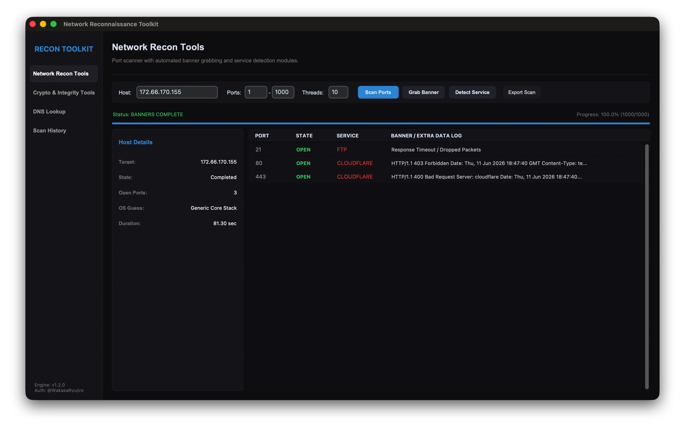
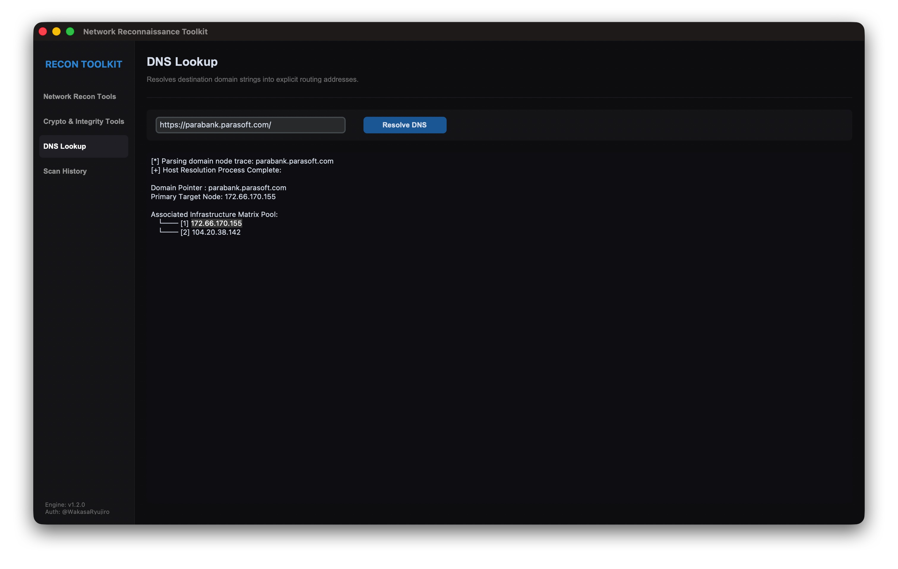
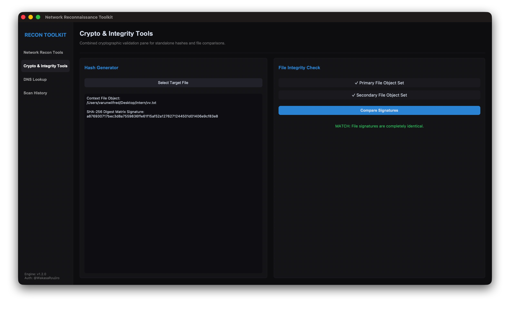

# NetworkReconToolkit

A Python-based Network Reconnaissance Toolkit developed by Varun Wilfred.

## Description

Python-based network reconnaissance toolkit featuring port scanning, banner grabbing, service detection, DNS lookup, SHA-256 hash generation, and file integrity verification.

## Screenshots

### Main Interface



### DNS Lookup



### Hash Generator



## Features

* TCP Port Scanning
* Banner Grabbing
* Service Detection
* DNS Lookup
* SHA-256 Hash Generation
* File Integrity Verification
* Scan History Logging
* Exportable Scan Reports

## Requirements

customtkinter>=5.2.0

## Installation

```bash
pip install customtkinter
```

## Run

```bash
python3 netrecon.py
```

## Author

Varun Wilfred

## Disclaimer

This project is intended for educational and authorized security assessment purposes only.

                                                                    @WakasaRyujiro
